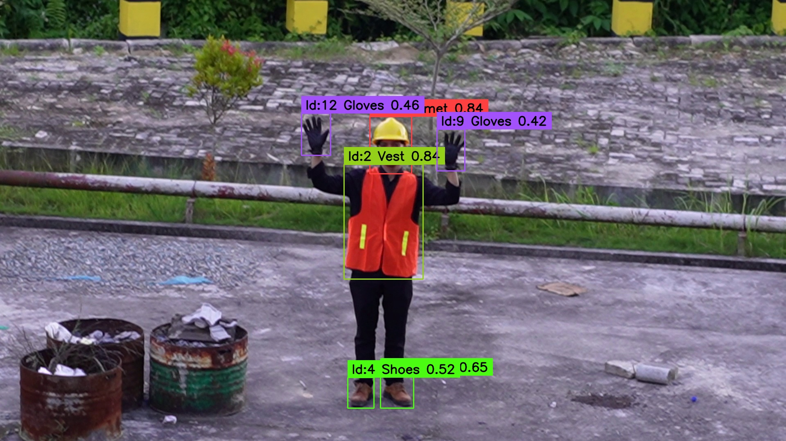
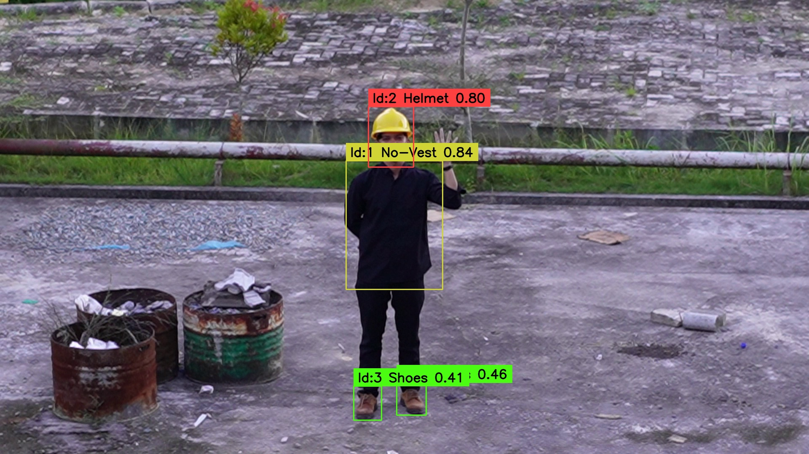

Deteksi Penggunaan Alat Pelindung Diri (APD), program akan mengirimkan notifikasi peringatan ketika terjadi pelanggaran penggunaan APD

- Hasil Pendeteksian Menggunakan Seluruh Atribut APD:


- Hasil Pendeteksian Tidak Menggunakan APD:


## <div align="center">Dokumentasi</div>

### Run Program

```bash
pip install -r requirements.txt
```

```bash
git clone https://github.com/MInsanKamil/Gemastik_PPE.git
```

```bash
cd Gemastik_PPE
```

Terakhir, Run file predict_yolov8_firebase_rpi_multithread.py
